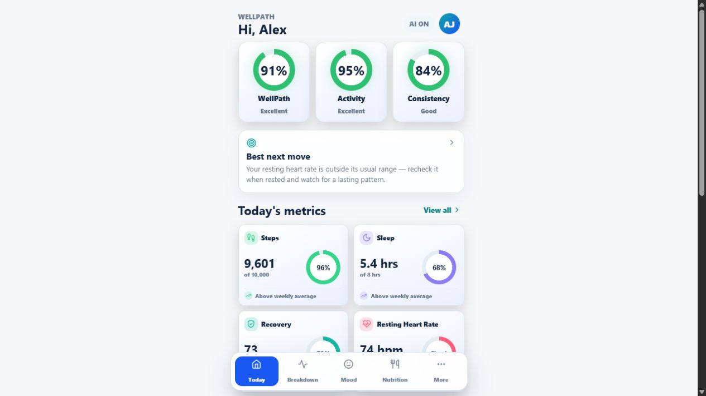
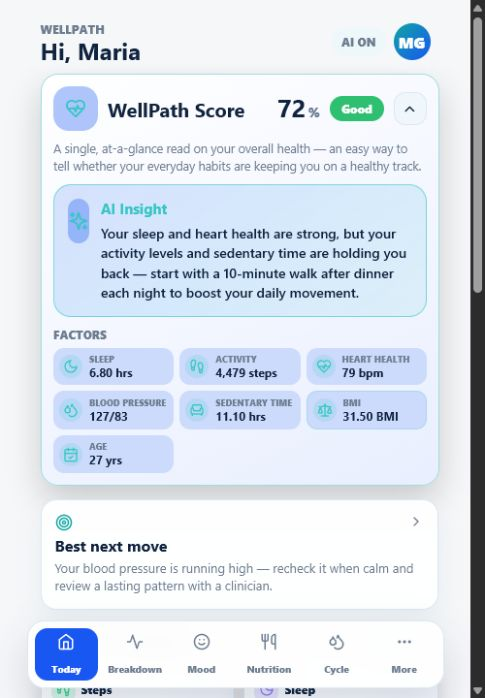
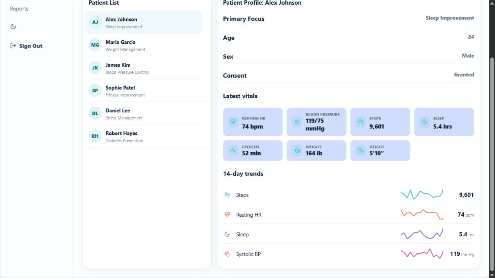

# WellPath

WellPath is a health tracking app I built to explore how the same set of health data can be shown
very differently depending on who's looking at it. A patient, their trainer, their clinician, and
an admin all use the app, but each one sees a different slice of the data. It's a lifestyle and
trend-tracking tool, not a medical one - it doesn't diagnose anything or give treatment advice.

<p align="center">
  
  
  
</p>

## The idea

There are four types of accounts and each gets its own version of the app:

- **Patient** - a phone app for your own daily metrics (activity, sleep, recovery, nutrition),
  breakdowns, mood and food logs, goals, and optional AI explanations of what your numbers mean.
- **Trainer** - a support view for the patients assigned to them: workout plans, recovery info,
  session logs, and encouragement notes.
- **Clinician** - a web/tablet dashboard for reviewing patient trends over time, with secure notes,
  care plans, and reports.
- **Admin** - an operations view for accounts, roles, consent info, and audit logs. Admins can't
  see anyone's actual readings, notes, mood entries, or AI conversations.

The part I cared about most was keeping those boundaries real. The permission checks happen on the
server, so an admin account can't just pull a patient's private data even if someone poked at the
API directly.

## Built with

React + Vite on the frontend, an Express API on the backend, and MySQL for storage. Auth is JWT
with bcrypt-hashed passwords. There's also a desktop web wrapper in `wellpath-health-web/`.

The AI explanations run through Groq. The important thing is the model never does the math - all the
numbers, trends, and flags are calculated from the database first, and the model only puts them into
plain sentences. That way it can't make up a stat.

## Running it

You'll need Node, npm, and MySQL.

```bash
cd wellpath-health-integrated/wellpath-integrated

# import wellpath_health_dump.sql into a MySQL db called `wellpath_health` first

cd backend
cp .env.example .env      # fill in your MySQL login and a JWT secret
npm install
npm run seed              # loads sample accounts + fake health data
npm run dev               # API runs on port 3000

# then in another terminal:
cd ..
npm install
npm run dev               # opens the Vite dev server, usually on 127.0.0.1:5173
```

## Demo accounts

On the login screen there's a row of demo accounts at the bottom — **click any one to sign
in instantly**, no typing needed. (If you'd rather type them, every account uses the password
`password123`.)

Each role sees a different version of the app:

- **Patient** — `alex@example.com` (also `maria@`, `james@`, `sophie@`, `daniel@`, `robert@` —
  each is a different health profile, e.g. Alex is sleep-deprived, Maria is working on weight,
  James has rising blood pressure).
- **Trainer** — `jordan@example.com`
- **Clinician** — `rivera@example.com`
- **Admin** — `admin@wellpath.example`

Try signing in as a patient first, then as the clinician to see the same data from the
provider side, and the admin to see how little an operations account is allowed to see.

## What's in the repo

The main app is under `wellpath-health-integrated/wellpath-integrated`. There are also two side
folders from the research part of the project: `wellpath-condition-models` (some ML work on health
risk prediction) and `wellpath-data-research` (data analysis notebooks and charts). Screenshots live
in `poster_assets`.

## Still to do

- Real HealthKit / Health Connect syncing on an actual phone instead of simulated readings
- Reminders and notifications
- Better admin controls and pagination for bigger datasets
- Some actual automated tests
